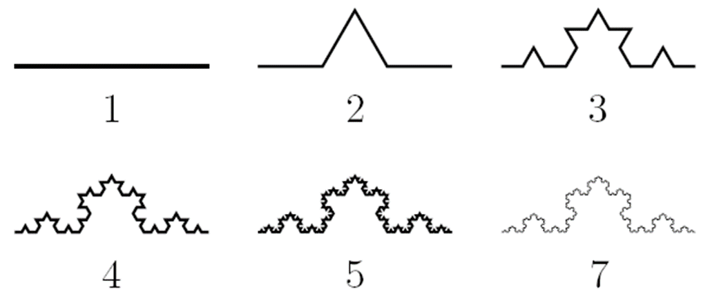
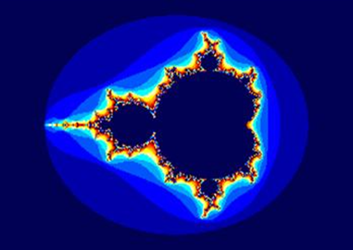

# Фракталы

Фракталом обычно называют геометрическую фигуру, у которой есть одно или несколько из следующих свойств: 

- Обладает сложной структурой при любом увеличении;
- Является (приближенно) самоподобной;
- Обладает дробной хаусдорфовой (фрактальной) размерностью, которая больше топологической;
- Может быть построена рекурсивными процедурами.

## Геометрические фракталы

Фракталы этого типа строятся поэтапно. Сначала изображается основа. Затем некоторые части основы заменяются на фрагмент. 
На каждом следующем этапе части уже построенной фигуры, аналогичные замененным частям основы, вновь заменяются на фрагмент, взятый в подходящем масштабе. Всякий раз масштаб уменьшается. 

Когда изменения становятся визуально незаметными, считают, что построенная фигура хорошо приближает фрактал и дает представление о его форме. Для получения самого фрактала нужно бесконечное число этапов. Меняя основу и фрагмент, можно получить много разных геометрических фракталов.

## Алгебраические фракталы

### Множества Жюлиа 

Рассмотрим бесконечную последовательность 

$$z_0,\ z_1=f(z_0),\ z_2 = f(z_1),\ \dots,\ z_{n+1} = f(z_n)$$

на комплексной плоскости. 

Любая точка $z$ комплексной плоскости имеет свой характер поведения при итерациях функции $f(z)$, а вся плоскость делится на части. 

Точки, лежащие на границах этих частей называют точками бифуркации. Множества бифуркационных точек часто имеют фрактальные свойства. 

### Множество Мандельброта 
 

Множество Мандельброта строится несколько иначе. 

Рассмотрим функцию 

$$f_c(z) = z^2 + С,\ \text{где $С$ — комплексное число.}$$

Построим последовательность этой функции с $z_0 = 0$. Все значения $С$, при которых эта последовательность ограничена, образуют множество Мандельброта. 

Оно было детально изучено самим Мандельбротом и другими математиками, которые открыли немало интересных свойств этого множества.

# Задание

Измените код программы и нарисуйте фрактал Мандельброта
